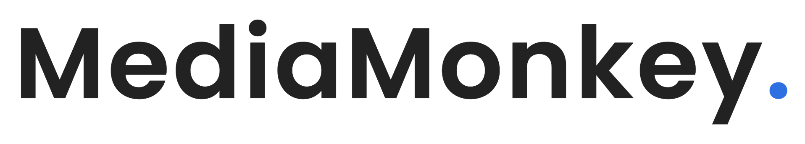

# Media Monkey

 

Welcome to Media Monkey - your media hub for video processing, uploading, and viewing.
Files are all stored securely through the Google Cloud Platform.

# Features

- Enterprise-grade Cloud Storage: Harnessing the capabilities of Google Cloud coupled with Firebase's agility, Media Monkey has high quality upload speeds, fortified security, and instantaneous access to your valuable media assets.

- Elegant Playback Interface: A confluence of aesthetic design principles and user-centricity, our playback interface ensures your audiences experience media the way it's meant to be – pristine and immersive.

# Installation

## Firebase

## GCP

## Technologies

- 
- 
- 
- 
- 
- 
- 
- 
