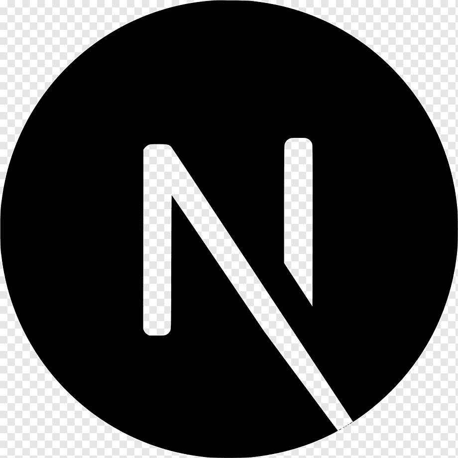

 


<br>

# MediaMonkey

<br>

Welcome to Media Monkey - your media hub for video processing, uploading, and viewing.
Files are all stored securely through the Google Cloud Platform.

<br>

# Features

- Cloud Based Video Platform: Harnessing the capabilities of Google Cloud coupled with Firebase's agility, Media Monkey has high quality upload speeds, fortified security, and instantaneous access to your valuable media assets.

- Elegant Playback Interface: A confluence of aesthetic design principles and user-centricity, our playback interface ensures your audiences experience media the way it's meant to be – pristine and immersive.

  <br>

# Installation

Make sure you are in the project's video-processing-service directory

```
cd video-processing-service

npm install
```

## Create a Firebase Project

- Navigate to the <a href='https://console.firebase.google.com/'>Firebase Console</a>.

  Create a new Firebase project. Note that this will also automatically create a Google Cloud project with the same project ID.
  Take note of the project id. This will be used throughout the setup.

  Tip: You can view the associated Google Cloud project using the same project id in the Google Cloud Console.

- Install <a href='https://cloud.google.com/sdk/docs/install'>gcloud and gsutil CLI tools </a>
  Depending on your operating system, follow the installation guide for gcloud and gsutil provided in the official documentation.

<br> 
Once installed, initialize and authenticate gcloud:

<br>

```
gcloud auth login # Copy the output url and paste it into your browser

gcloud config set project <PROJECT_ID>

```

<br>

## Push docker image to the Google Artifact Registry

Follow the steps below to build and deploy our Docker image for the video processing service to Google Cloud Run:

<br>
Create an Artifact Registry repository:

- Run the following commands in the terminal

```
gcloud services enable artifactregistry.googleapis.com

```

```
gcloud artifacts repositories create video-processing-repo \
  --repository-format=docker \
  --location=us-central1 \
  --description="Docker repository for video processing service"

```

#

<br>
Create a <a href="#"></a> image. By following the naming convention mentioned below, Docker knows the target project and where to push the image.

<br>

```
docker build -t us-central1-docker.pkg.dev/<PROJECT_ID>/video-processing-repo/video-processing-service .
```

Ensure <a href="#"></a> uses gcloud as the credential helper:

```
gcloud auth configure-docker us-central1-docker.pkg.dev
```

Deplay container to Cloud Run via the CLI.

```
gcloud run deploy video-processing-service --image us-central1-docker.pkg.dev/PROJECT_ID/video-processing-repo/video-processing-service \
  --region=us-central1 \
  --platform managed \
  --timeout=3600 \
  --memory=2Gi \
  --cpu=1 \
  --min-instances=0 \
  --max-instances=1 \
  --ingress=internal
```

<br>

Now, push the <a href="#"></a>
image to the Google Artifact Registry:

```
docker push us-central1-docker.pkg.dev/<PROJECT_ID>/video-processing-repo/video-processing-service
```

<br>

#

## Setting Up Google Pub/Sub

Use the gcloud CLI to create a new topic:

```
gcloud pubsub topics create <TOPIC_NAME>
```

Create a Pub/Sub Subscription

Once you have the endpoint URL of the video processing service deployed on Cloud Run, establish a Pub/Sub subscription:

```
gcloud pubsub subscriptions create <SUBSCRIPTION_NAME> \
  --topic=<TOPIC_NAME> \
  --push-endpoint=<SERVICE_URL> \
  --ack-deadline=600

```

#

Make sure to replace:

<SUBSCRIPTION_NAME> with the name of your subscription.
<TOPIC_NAME> with the name of the topic you just created.
<SERVICE_URL> with the endpoint URL of your video processing service from Cloud Run.
Alternative: You can also set up this subscription via the Google Cloud Console. Navigate to Google Cloud Pub/Sub Console to do this manually.

#

## Create video buckets

- First, let's create a bucket to store raw video files.
  Replace <BUCKET_NAME> with the desired name for your raw videos bucket.

- Next, configure this bucket to send notifications to the Pub/Sub topic whenever a new video file is uploaded.

```
gsutil mb -l us-central1 --pap=enforced gs://<BUCKET_NAME>

gsutil notification create -t <TOPIC_NAME> -f json -e OBJECT_FINALIZE gs://<BUCKET_NAME>

```

Create the Processed Videos Bucket

Now, let's create another bucket where processed videos will be stored.

```
gsutil mb -l us-central1 gs://<BUCKET_NAME>
```

## Create Firebase Web App

<br>

Go to the Firebase Console.
Select your desired project.
Navigate to Project Settings:

- Click the Gear icon located next to "Project Overview".
  Choose "Project Settings".
  Add a Web App:

Scroll down to the "Your apps" section at the bottom of the page.

- Click the </> icon to initiate the process of adding a new web app to your project.

Note: Firebase also allows creating iOS or Android apps, but for the purpose of this guide, we'll focus on the web app.

Register Your App:

- Provide a suitable name for your web app.
  Hit the "Register app" button.

#

## Setting Up Firestore Database

<br>
Go to Firebase Console:

- Visit the Firebase Console.
  Access Firestore Database:

- Within the left sidebar under the "Build" section, select "Firestore Database".
  Initiate Database Creation:

- Click on "Create Database".
  Opt for "Start in production mode" to ensure the highest security standards initially.

#

## Setting Up Firebase CLI

Install Firebase CLI:

```
npm install -g firebase-tools
```

Authenticate with Google:

After installing, authenticate the CLI with your Google account using the following command:

```
firebase login
```

By following these steps, you've successfully installed and authenticated the Firebase CLI.

#

## Initialize Firebase Functions

Within the api-service directory run the following.

```
npm install
firebase init functions
```

Within the api-service/functions directory run the following.

```
firebase deploy --only functions
```

#

## Configuring Permissions for Firebase Functions

Allow Firebase Functions to Access Cloud Storage:

- In the GCP console, go to Firebase Functions.
  Open createUser function and go to its Details page.
  Note the service account email (e.g., '1234-compute@developer.gserviceaccount.com').

- In Cloud Storage, access the raw-videos bucket.
  Under Permissions, click "Grant Access".
  Add the noted service account email as a principal and assign the "Storage Object Admin" role. This lets Firebase Functions access the bucket.
  Grant Token Creator Role for Signed URLs:

- Visit GCP IAM console.
  Locate the service account from the previous step.
  Click the edit button next to it.
  Add the "Service Account Token Creator" role. This allows generateUploadUrl function to create signed URLs.
  Now, your Firebase Functions are properly configured to interact with Cloud Storage.

## Enable CORS for our Cloud Storage Bucket

To allow our Next.js app to upload videos to the Cloud Storage bucket, we need to set up CORS.

Update Bucket with CORS Configuration:

- Run the following command, replacing <YOUR_RAW_VIDEOS_BUCKET_NAME> with the name of your bucket:

```
  gcloud storage buckets update gs://<YOUR_RAW_VIDEOS_BUCKET_NAME> --cors-file=utils/gcs-cors.json
```

With these steps, CORS is now enabled for your Cloud Storage bucket, allowing uploads from the Next.js app.

## Launching the Next.js App

Navigate to the web-client directory:
Install the required packages:

```
cd web-client
npm install
```

Start the application:

```
npm run prepare-and-start
```

#

## Video Processing User Flow

1. User uploads a video via the Next.js app.
2. Video is stored in the Raw Videos Bucket.
3. A notification is triggered, informing the Google Pub/Sub topic of the new video.
4. Video Processing Service, a subscriber to the topic, gets the notification.
5. The video is processed.
6. Processed video is saved in the Processed Videos Bucket.
7. Metadata or other relevant data might be stored in the Firestore Database via Firebase Functions.

## GCP

## Technologies

- <a href="#"></a>
- <a href="#"></a>
- <a href="#"></a>
- <a href="#"></a>
- <a href="#"></a>
- <a href="#"></a>
- <a href="#"></a>
- <a href="#"></a>

#

###### Return to [Top](#media-monkey)
